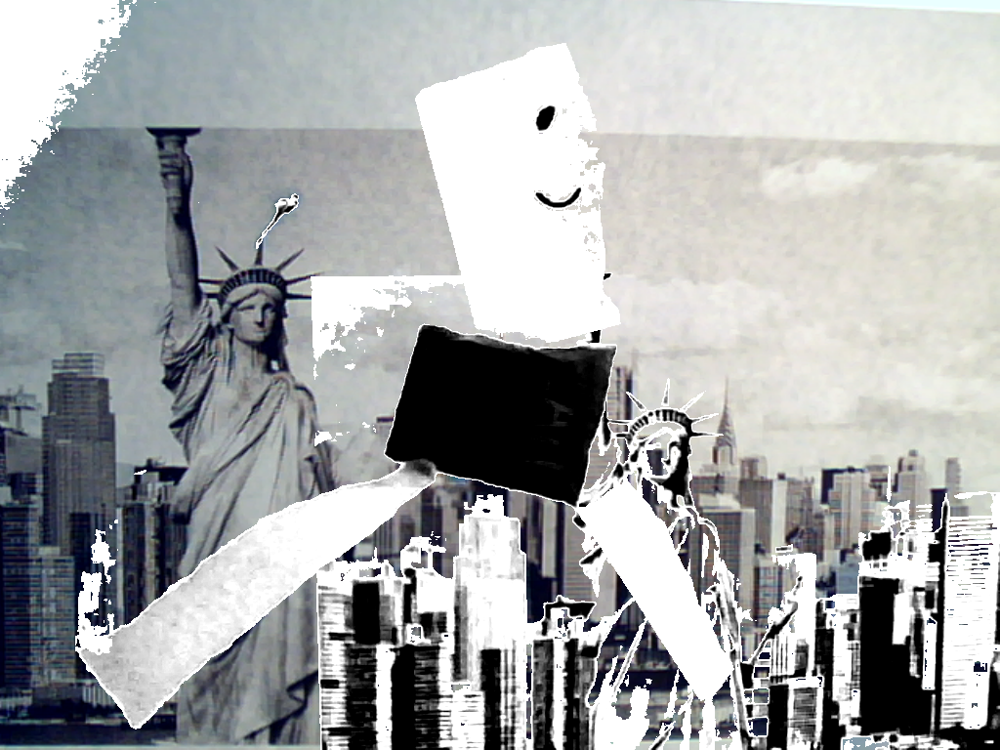
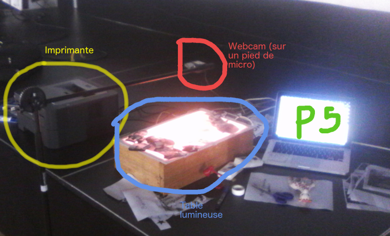

#Bebert — Bidouciel d'illico-cinoche

Voici un petit programme réalisé avec Processing (+ shaders) pour la création visuelle en direct… (plus ou moins du VJ quoi). 

Ce programme accompagné d’un dispositif adéquat (un banc-titre, ou une table luminseuse avec une petite webcam) permet de créer en direct des boucles d’images. 

Ces boucles d’images peuvent être incrustées en direct sur des décors (décors pouvant être des images capturées par le dispositif ou bien issus d’une banque d’image).
J’ai fait ce programme dans l’idée de pouvoir réaliser en direct des animations à base de papier découpé, de figurines…

## A faire:

1) Portée des effets
2) Ergonomie/raccourics/Interface avec Arduino
+ Version openFrameworks pour Raspberry Pi

### Ergonomie, optimiser…

Raccouris généraux
1) Afficher flux vidéo : S
2) Augmenter/diminuer Luminosité : B/N
3) Passer en mode Incrustation (non-reversible à modifier) : clic
4) Clic + position XY souris Modification Contraste/Saturation
5) Seuil incrustation

Raccourcis locaux

## Souris Verte le 3 mars

Impression des têtes du public en direct, sur scène. Jeu 